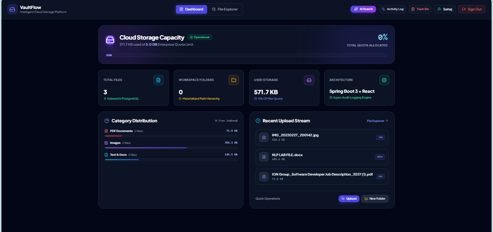
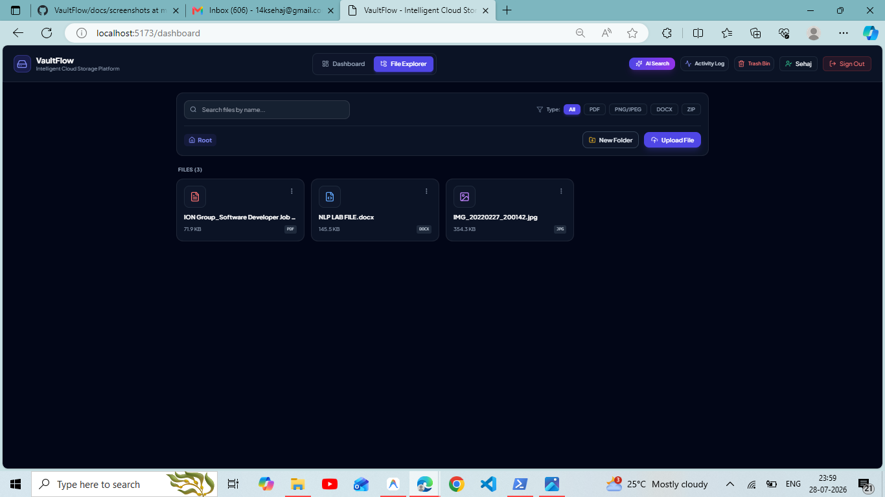
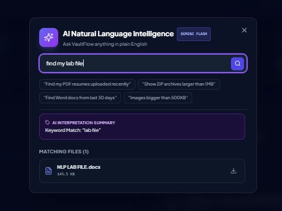
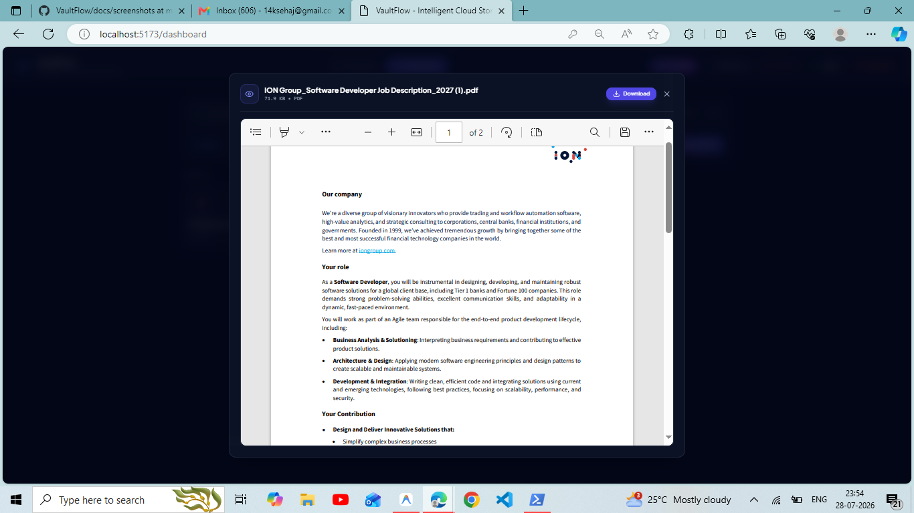
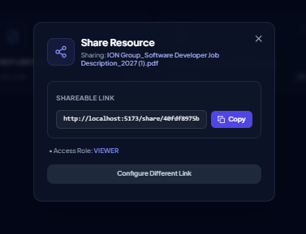
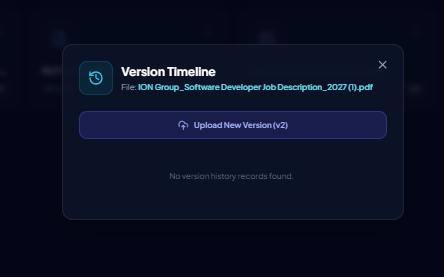
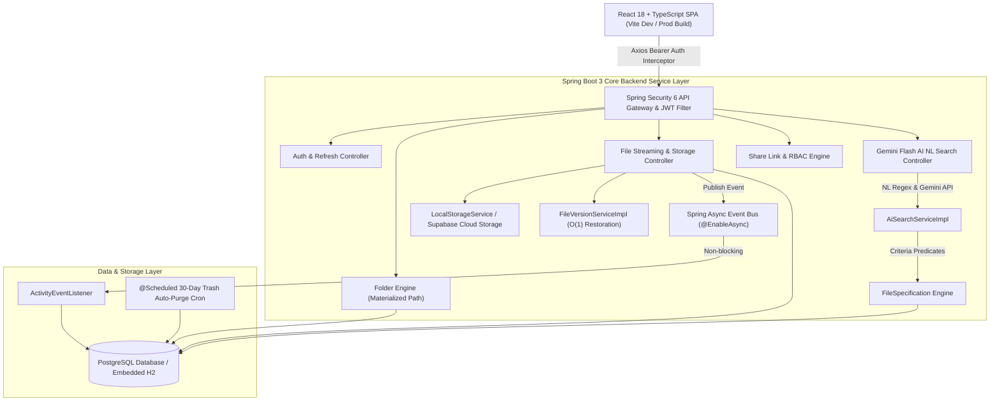
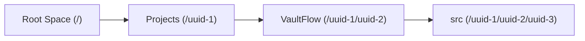
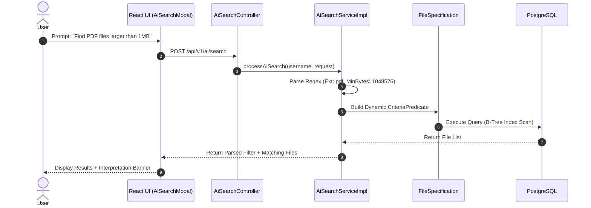

# VaultFlow – Intelligent Cloud Storage & Collaboration Platform

[](https://github.com/sehaj141/VaultFlow)
[](https://openjdk.org/)
[](https://spring.io/projects/spring-boot)
[](https://react.dev/)
[](https://www.typescriptlang.org/)
[](https://tailwindcss.com/)
[](LICENSE)

> **VaultFlow** is a production-grade, full-stack Cloud Storage & Intelligence Platform designed with enterprise software engineering principles. Built with **Java 17, Spring Boot 3, React 18, TypeScript, Tailwind CSS, PostgreSQL, and Google Gemini AI**, VaultFlow delivers advanced folder hierarchy engines, immutable file versioning, event-driven audit logging, soft-delete lifecycles, and natural language search capabilities.

---

## 📸 Product Screenshots & Visual Demonstrations

*(Place your screenshots in `docs/screenshots/` to display them here)*

| **Operations Analytics Dashboard** | **Hierarchical File Explorer** |
| :---: | :---: |
|  |  |

| **AI Natural Language Intelligence Search** | **In-Browser Document & PDF Previewer** |
| :---: | :---: |
|  |  |

| **Granular Sharing & RBAC Security** | **Immutable Version History Timeline** |
| :---: | :---: |
|  |  |

---

## 🏗️ High-Level System Architecture

VaultFlow follows a decoupled, multi-tiered event-driven architecture designed for $O(1)$ query lookups, non-blocking asynchronous event processing, and seamless cloud scalability.



---

## 🧠 Technical Highlights & SDE System Design Decisions

### 1. 📁 Materialized Path + Adjacency List Folder Engine
* **The Problem**: Traditional parent-child `parent_id` recursive queries (Adjacency List) require $O(N)$ database round-trips or complex recursive CTEs to resolve full breadcrumb paths.
* **Our Solution**: VaultFlow combines **Adjacency Lists** with **Materialized Paths** (`/root_uuid/folder1_uuid/folder2_uuid`).
* **Performance Gain**: Resolving full ancestor breadcrumb trails and retrieving entire subtrees is reduced to a single $O(1)$ string prefix matching query (`WHERE path LIKE '/root_uuid/%'`).



### 2. 🔄 Depth-First Search (DFS) Cycle Detection Algorithm
* **Security & Stability**: Prevents invalid circular parent assignments (e.g. moving Folder A into its own subfolder B).
* **Algorithm**: Performs a Depth-First Search traversal through parent nodes prior to executing any folder move transaction:
  $$\text{TargetParent} \notin \text{Descendants}(\text{SourceFolder})$$

### 3. 🤖 AI Natural Language Search & Predicate Compiler
* VaultFlow processes plain English user queries (*"Find my PDF documents larger than 2MB uploaded last week"*) through an intelligent natural language parsing engine:
  * **File Extension Translation**: Maps terms like *"word doc"*, *"pdf"*, *"images"* to strict `.docx`, `.pdf`, `.png` extensions.
  * **Byte Boundary Computation**: Translates human expressions (*"2MB"*, *"500KB"*) into exact byte thresholds ($2 \times 1024 \times 1024$ bytes) applied to `minSizeBytes` / `maxSizeBytes` JPA Criteria API predicates.
  * **Relative Date Arithmetic**: Calculates relative timestamps (`Instant.now().minus(7, DAYS)`).



### 4. ⚡ Event-Driven Asynchronous Audit Logging
* **Non-Blocking Performance**: User operations (file upload, deletion, version restoration, public share link creation) publish lightweight `ActivityEvent` records.
* **Spring `@EnableAsync`**: The `ActivityEventListener` handles event persistence in a dedicated background thread pool without delaying client HTTP responses.

---

## 🛠️ Complete Technology Stack

| Component | Technology | Rationale / Application |
| :--- | :--- | :--- |
| **Language** | Java 17 (LTS) | Strong typing, records, pattern matching, high performance. |
| **Backend Framework** | Spring Boot 3.3.2 | Spring Data JPA, Spring Security 6, Spring Async, Scheduling. |
| **Authentication** | JJWT 0.12.5 & BCrypt | Stateless JWT Bearer tokens + DB Refresh Token rotation. |
| **Database** | PostgreSQL / H2 | Relational integrity, composite B-Tree indexes, GIN search. |
| **Frontend UI** | React 18 + TypeScript | Component-based state, type-safe API schemas. |
| **Styling** | Tailwind CSS 3.4 | Modern dark mode glassmorphism UI tokens & micro-animations. |
| **Build Tooling** | Maven & Vite | Fast server HMR and production JAR packaging. |

---

## 🚀 Step-by-Step Installation & Running Guide

### Prerequisites
* **Java Development Kit (JDK 17 or higher)**
* **Node.js (v18 or higher)**
* **Maven (3.8+)**

---

### Step 1: Clone the Repository
```bash
git clone https://github.com/sehaj141/VaultFlow.git
cd VaultFlow
```

---

### Step 2: Launch the Spring Boot Backend Server

Navigate to the backend directory and launch the application:

```bash
cd backend
mvn spring-boot:run
```

> **Note**: Zero database setup is required for local testing! The backend defaults to an embedded, high-performance in-memory H2 database (`application-dev.yml`). The server will boot cleanly on **`http://localhost:8080`**.

---

### Step 3: Launch the React Frontend Application

Open a second terminal window, navigate to the frontend directory, install packages, and start Vite:

```bash
cd frontend
npm install
npm run dev
```

The dev server will launch on **`http://localhost:5173`**.

---

### Step 4: Access the Dashboard & App

1. Open your browser to **`http://localhost:5173`**.
2. Click **"Don't have an account? Sign up"** to register a test user account.
3. Experience the full **VaultFlow Operations Dashboard & File Explorer**!

---

## 📄 Project Directory Structure

```
VaultFlow/
├── docs/
│   └── screenshots/             # Repository UI Screenshots
├── backend/
│   ├── src/main/java/com/vaultflow/
│   │   ├── config/              # SecurityConfig, CorsConfig
│   │   ├── controller/          # REST Controllers
│   │   ├── dto/                 # Request & Response DTOs
│   │   ├── entity/              # JPA Entities (User, Folder, FileItem, FileVersion, etc.)
│   │   ├── event/               # Spring Async Activity Event Bus
│   │   ├── repository/          # Spring Data JPA Repositories & Specifications
│   │   ├── security/            # JwtAuthFilter, JwtTokenProvider, CustomUserDetailsService
│   │   └── service/             # Business Logic & Storage Implementations
│   └── src/main/resources/
│       ├── application.yml      # Base Config
│       └── application-dev.yml  # Zero-Config H2 Dev Profile
└── frontend/
    ├── src/
    │   ├── api/                 # Axios Service Modules
    │   ├── components/          # Glassmorphic Modals & Dashboard Analytics Views
    │   ├── context/             # AuthContext State Provider
    │   ├── pages/               # Explorer, Login, Register, Public Share Pages
    │   └── types/               # TypeScript Interfaces
    ├── index.html
    └── vite.config.ts
```

---

## 📜 License

Distributed under the **MIT License**. Free for educational, internship presentation, and commercial use.
